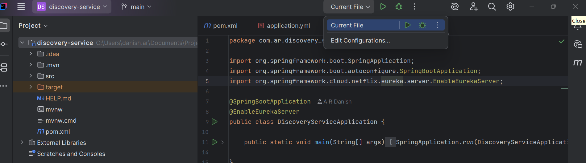
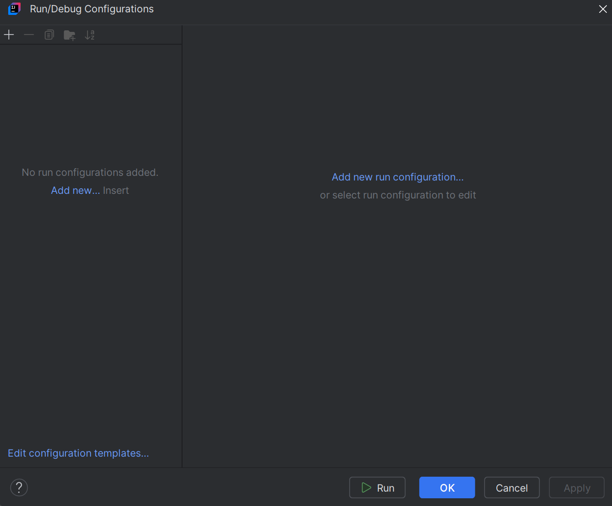
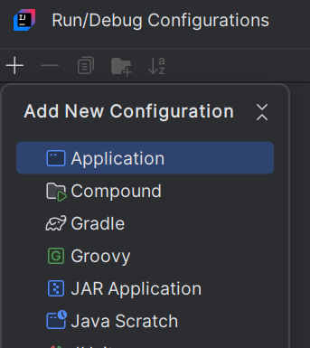
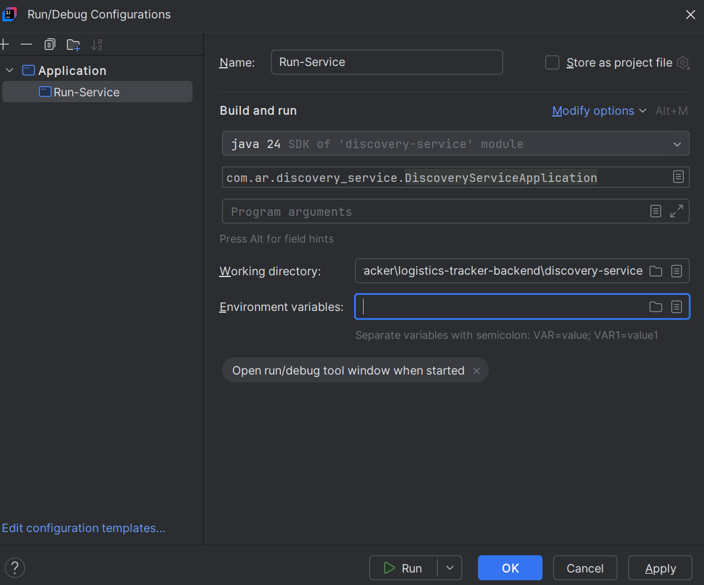
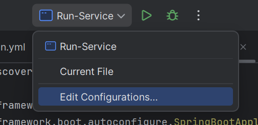
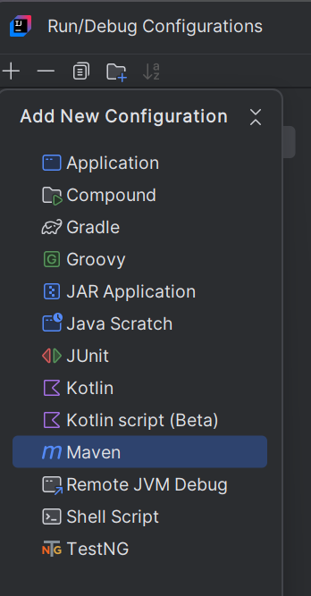
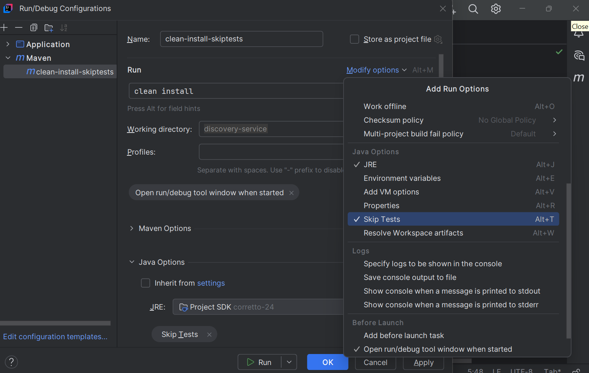
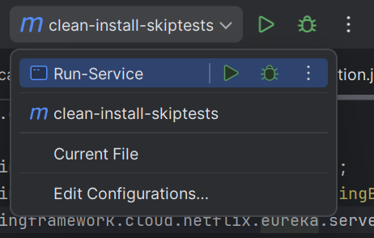
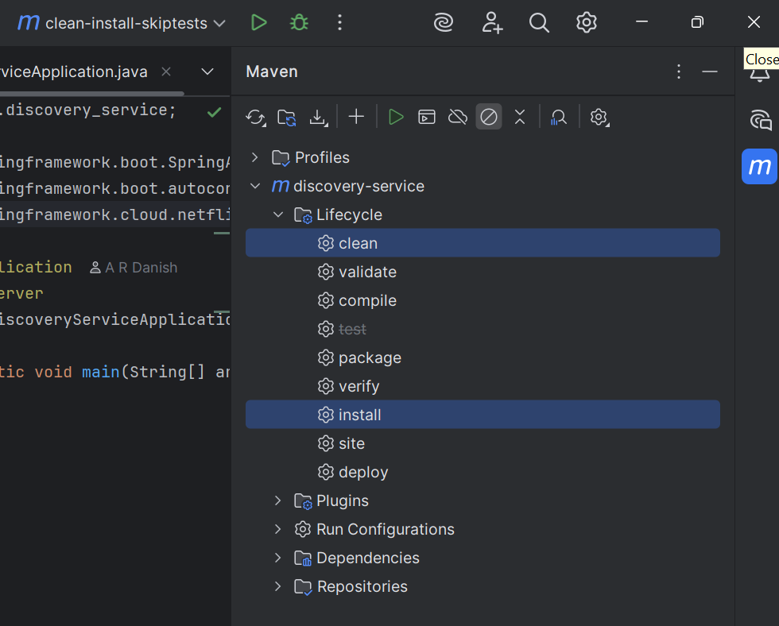

## Configuration to run the spring boot project:

Edit Configurations...

Click **+** icon on top left

Application

Give any name and select the main class, the file where @SpringBootApplication is written.

Apply > Ok or Just ok

Now run directly from Run-Service. Just click play icon when Run-Service is selected.

## Add maven clean install skiptests as well

Select + > Maven

Give any name, select **clean install** in Run options, optionally add **Skip Tests** if you want to skip tests. Apply and Ok or just Ok.

Now do maven clean install using single click. Similar can be achieved using maven options.

maven > service-name > lifecycle > clean install skiptest(notice the icon selected)

---
